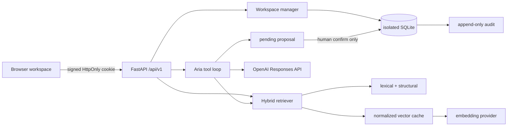

# Architecture

## Runtime

The browser owns graph layout. FastAPI serves typed semantic nodes and edges;
`@xyflow/react` and Dagre calculate the responsive layout in the client.

## Memory and embeddings

Episode and fact rows keep `schema_version=1`. The independent
`app_migrations` table versions embeddings, sessions, visible turns, proposals,
audit and quota storage.

The canonical embedding surface contains only entity type, project, kind,
status, tags, title, content and reason. It excludes identifiers, secrets and
arbitrary metadata. SHA-256 hashes select new or changed rows. Vectors are
normalized float32 SQLite BLOBs. Ordinary recall loads the matrix at service
startup and embeds only the query.

The provider interface supports batched document embeddings and single-query
embeddings. The local deterministic provider makes tests and degraded mode
fully offline; the OpenAI provider uses `text-embedding-3-large`,
`dimensions=256`, and batches of 64.

## Approval boundary

Aria can call `propose_memory_write`, which only inserts a `pending` proposal.
The model has no confirmation tool. The authenticated confirm endpoint validates
and executes one of four domain operations:

- `remember_episode`
- `record_fact`
- `supersede_fact`
- `invalidate_fact`

Confirmation is idempotent. Rejection changes no memory. Every transition emits
an append-only audit event. The MUD guard also checks proposed merge decisions
against active project-boundary decisions; a conflict transitions the proposal
to `failed` without changing memory.

## Privacy and availability

Responses requests use `store: false`, a bounded visible history, retrieved
excerpts rather than the corpus, and a stable SHA-256 safety identifier. The
service does not intentionally log prompts, memory bodies, secrets or access
codes. If OpenAI or dense retrieval fails, writes still persist and retrieval
returns lexical/structural evidence with `degraded=true`.

Cloud workspaces use one SQLite file per authenticated browser under `/tmp`.
This provides demo isolation rather than durable cloud storage. Local workspaces
persist under gitignored `data/`.
