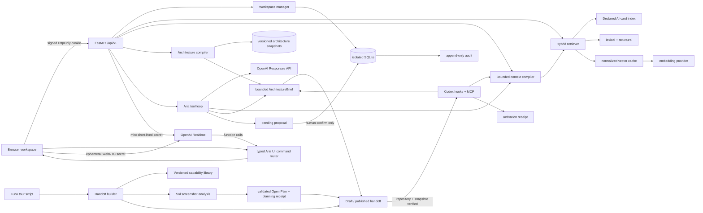

# Architecture

```yaml
ai_card:
  id: command-center.architecture
  repository: Command Center
  title: Command Center Architecture Index
  kind: architecture_index
  audience: [user, engineer, ai_agent, evaluator]
  status: implemented
  owner_area: system architecture
  main_files: [services/memory/aria_memory, apps/web, plugins/codex-command-center]
  public_interfaces: ["/api/v1", "POST /mcp", "command-center-architecture-brief-v1"]
  provides: [system architecture orientation, data flow and approval boundaries]
  depends_on: [command-center.architecture-awareness, command-center.declared-context, command-center.handoffs]
  safe_edit_points: [documented service boundaries, additive application migrations]
  risk_areas: [cross-workspace leakage, bypassing pending proposal boundary]
  graph_rag_entities: [Aria, ArchitectureCompiler, Toolbox, Codex Command Center]
  last_verified: 2026-07-19
```

## Runtime



The remote MCP endpoint and REST routes call the same workspace handlers.
Streamable HTTP is stateless JSON-RPC; the local stdio adapter preserves the
same schemas and results for clients that cannot conveniently attach a remote
token header.

The `ArchitectureCompiler` is the canonical path for full architecture
awareness. It resolves only a registered repository ID, name, or alias, selects
an active immutable snapshot, ranks declared cards and AST-derived H2 sections,
and enforces the budget over the fully serialized packet. Aria, handoffs, MCP,
Codex hooks, and the browser use that same output. The legacy ContextCompiler
continues to provide separately labelled durable facts, episodes, and the
latest declared-document projection.

See [full architecture awareness](architecture-awareness.md) for the declaration,
sync, storage, evidence, and degraded-state contracts.

## Capability and handoff domain

Capabilities use the composite key `(stable_id, version)`. Their canonical
model content is hashed with SHA-256. Trust filtering excludes untrusted and
retired records from normal recommendation. Instructions remain
provider-neutral and contain no arbitrary executable payload.

Handoffs are separate from memory. A draft pins exact capability versions, an
architecture snapshot, exact document/section versions, and selected durable
evidence. Application migration 6 adds the persisted planning receipt: model,
capability reference, architecture snapshot, evidence IDs, generation time,
degradation state, and reasons. Publication records an immutable packet; editing a published packet
creates another lineage version. A later architecture sync changes new task
packs but not an existing published handoff. Revocation prevents new loads
without destroying the record. Every successful client load records a separate
activation receipt.

Screenshot bytes exist only long enough to validate detected MIME, enforce size
and dimension limits, resize the analysis copy, compute the hash, and optionally
call Sol through Responses. Stored screenshot data is metadata plus derived
findings. Returned observations are always marked as inferences.

The browser owns graph layout. FastAPI serves typed semantic nodes and edges;
`@xyflow/react` and Dagre calculate the responsive layout in the client.
Command Center-native evidence cards map declared structure to violet, durable
memory to amber, and active packet sources to cyan. A custom SVG edge particle
shows only relationships involved in the active packet. This is presentation
state: the canvas never creates a second graph store or writes layout into
memory. See [evidence graph canvas](graph-canvas.md).

Aria voice is a transport adapter over the browser command router. The declared
command catalog, result contract, shared Handoff Controller, guided-tour state, and interface dispatcher do
not import a voice SDK. Realtime function calls enter the same typed router that
tests and visible tour controls use. Results are returned only after the target
surface has rendered or the graph movement has been requested, keeping narration
aligned with the interface. See [Aria voice](aria-voice.md).

Text Aria recognizes frontend redesign intent and emits
`command-center-redesign-suggestion-v1`. The guided tour has generic overview
and redesign modes. Optional Luna generation receives only bounded receipts and
falls back to the deterministic `command-center-tour-script-v1` script.

## Memory and embeddings

Episode and fact rows keep `schema_version=1`. The independent
`app_migrations` table versions embeddings, sessions, visible turns, proposals,
audit, quota, capabilities, handoffs, activations, and workspace tokens.
Migration 6 extends handoffs without changing memory row schema version 1.

The canonical embedding surface contains only entity type, project, kind,
status, tags, title, content and reason. It excludes identifiers, secrets and
arbitrary metadata. SHA-256 hashes select new or changed rows. Vectors are
normalized float32 SQLite BLOBs. Ordinary recall loads the matrix at service
startup and embeds only the query.

The provider interface supports batched document embeddings and single-query
embeddings. The local deterministic provider makes tests and degraded mode
fully offline; the OpenAI provider uses `text-embedding-3-large`,
`dimensions=256`, and batches of 64.

The latest declared-document projection remains available for existing
retrieval and its versioned dimension palette. The canonical architecture store
is migration 5: repositories, snapshots, document versions, AST sections,
optional section embeddings, typed explicit edges, and issues. Source URIs are
always relative. Snapshot activation is transactional; rejected snapshots
cannot replace the active one, and historical evidence remains resolvable.

`command-center-task-pack-v2` combines two distinct bounded payloads:
`architecture_brief` and `durable_context`. Keeping them distinct preserves the
difference between repository structure and human-confirmed history. Prompts
enter POST bodies, never URL or access-log query strings.

## Approval boundary

Aria can call `propose_memory_write`, which only inserts a `pending` proposal.
Realtime voice can call `draft_memory_proposal`, which reaches the same pending
proposal store. Neither model has a confirmation tool. The authenticated confirm endpoint validates
and executes one of four domain operations:

- `remember_episode`
- `record_fact`
- `supersede_fact`
- `invalidate_fact`

Confirmation is idempotent. Rejection changes no memory. Every transition emits
an append-only audit event. The MUD guard also checks proposed merge decisions
against active project-boundary decisions; a conflict transitions the proposal
to `failed` without changing memory.

## Privacy and availability

Responses requests use `store: false`, a bounded visible history, retrieved
excerpts rather than the corpus, and a stable SHA-256 safety identifier. The
service does not intentionally log prompts, memory bodies, secrets or access
codes. If OpenAI or dense retrieval fails, writes still persist and retrieval
returns lexical/structural evidence with `degraded=true`.

Local workspaces use one SQLite file per authenticated browser under gitignored
`data/`. The production deployment contract uses Cloud SQL PostgreSQL for
mutable hosted workspaces; an instance filesystem is not a durability boundary.

Hook telemetry is separate from memories. Unknown event kinds fail with 422,
and accepted detail is reduced to a declared safe field set. A Stop hook may
draft a pending proposal when explicitly enabled; it is off by default because
Codex emits Stop after every turn. Only the browser confirmation endpoint can
mutate durable memory.

Codex joins the browser’s isolated workspace through a single-use pairing code
sent in a POST body and held for five minutes. The exchange returns a random,
revocable workspace token. The server persists only its SHA-256 hash; the plugin
stores the original outside the repository with user-only permissions. Direct
remote clients send it through `X-Command-Center-Token`.

For voice, FastAPI uses the authenticated cookie to mint a ten-minute ephemeral
Realtime secret and never returns the standard API key. The browser then creates
a WebRTC peer connection directly to OpenAI. Closing voice stops local media
tracks, the data channel, remote audio, and the peer connection.
